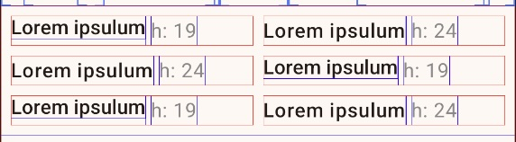

Sample project to show the differences of using a `Text` composable configured with

```kotlin
    Text(
        text = "Lorem ipsulum",
        style = TextStyle(
            lineHeight = 24.sp,
            fontSize = 16.sp,
            fontWeight = FontWeight.W500
        ),
    )
```
or

```kotlin
    Text(
        text = "Lorem ipsulum",
        lineHeight = 24.sp,
        fontSize = 16.sp,
        fontWeight = FontWeight.W500
    )
```

The displayed text will have a different font with a different height.


